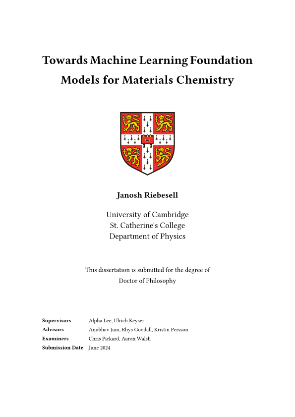

<h1 align="center">
   
  PhD Thesis
</h1>

Titled "**Towards Machine Learning Foundation Models for Materials Chemistry**" submitted to the [University of Cambridge Department of Physics](https://www.phy.cam.ac.uk) in April 2024.

Archived in [Apollo repository](https://www.repository.cam.ac.uk/items/77329fb7-cf3a-42e4-a44d-ac3651587b26) ([DOI: 10.17863/CAM.113233](https://doi.org/10.17863/CAM.113233)).

> 

## Source code

[`thesis.typ`](thesis.typ) and [`template.typ`](template.typ).
